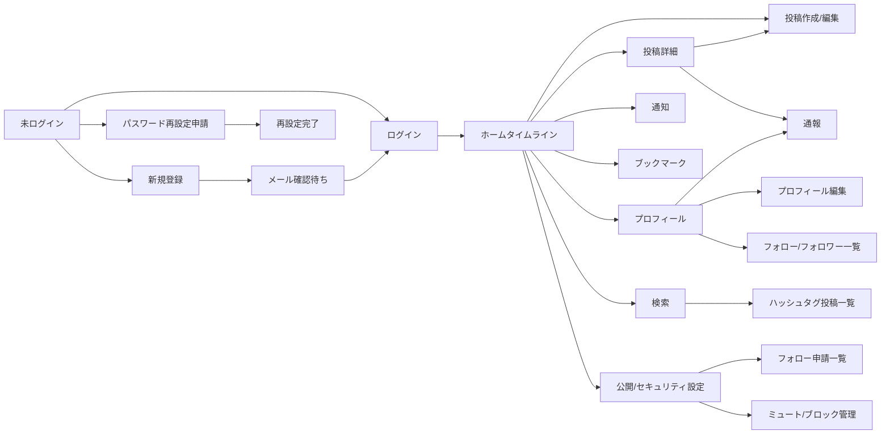
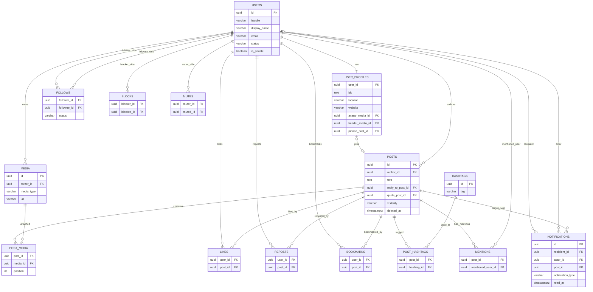
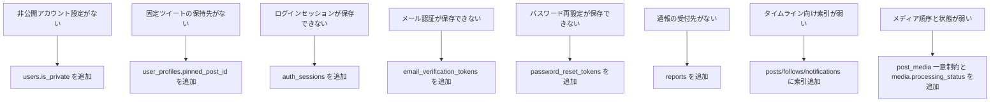

# tiny-sns Mermaid図一覧

この文書は、ルートに分散していた Mermaid の `.mmd` ファイルを Markdown に統合したものです。
共有して使う図の正本はこのファイルとし、他の文書では必要に応じてこのファイルを参照します。

図だけを単独で開くよりも、以下の点が分かりやすくなるように整理しています。

- その図が何を説明しているか
- どこを見れば概要を掴めるか
- 他の設計資料とどうつながるか

## 図の使い分け

| 図 | 用途 | まず見るポイント |
| --- | --- | --- |
| 機能スコープ図 | tiny-sns のMVP範囲を俯瞰する | どの機能群があるか |
| 画面遷移図 | 主要画面の導線を把握する | 未ログインからホームまでの流れ |
| コアER図 | SNS中心機能のデータ関係を掴む | `users`、`posts`、`follows` の関係 |
| DBMLギャップ補完図 | 元のDBMLに何を補ったかを確認する | 追加したテーブルとカラム |

## 1. 機能スコープ図

この図は、tiny-sns のMVPで扱う機能領域を大づかみに示しています。

読み方のポイントは次の通りです。

- 中央の `tiny-sns MVP` から、機能ドメインごとに枝分かれしています
- 1段目は機能カテゴリ、2段目は具体的な機能です
- 実装順を考えるときは、`認証・アカウント` と `投稿` と `タイムライン` を先に見ると全体像を掴みやすいです

```mermaid
flowchart TB
    service[tiny-sns MVP] --> account[認証・アカウント]
    service --> profile[プロフィール]
    service --> post[投稿]
    service --> timeline[タイムライン]
    service --> discovery[検索・発見]
    service --> social[交流]
    service --> notification[通知]
    service --> safety[安全管理]

    account --> signup[新規登録]
    account --> login[ログイン/ログアウト]
    account --> session[セッション管理]
    account --> verify[メール確認]
    account --> recovery[パスワード再設定]
    account --> privacy[公開設定]

    profile --> profile_view[プロフィール表示]
    profile --> profile_edit[プロフィール編集]

    post --> create_post[投稿作成]
    post --> edit_post[投稿編集]
    post --> delete_post[投稿削除]
    post --> reply_quote[返信/引用]
    post --> media_attach[メディア添付]
    post --> visibility[公開範囲設定]

    timeline --> home_tl[ホームタイムライン]
    timeline --> user_tl[ユーザー投稿一覧]
    timeline --> thread_view[スレッド表示]
    timeline --> bookmark_tl[ブックマーク一覧]

    discovery --> search[ユーザー/投稿/タグ検索]
    discovery --> hashtag_tl[ハッシュタグ投稿一覧]

    social --> follow[フォロー/解除]
    social --> follow_request[フォロー申請承認]
    social --> like[いいね]
    social --> repost[リポスト]
    social --> bookmark[ブックマーク]
    social --> mention[メンション]

    notification --> inbox[通知一覧]
    notification --> read_state[既読/未読]

    safety --> mute[ミュート]
    safety --> block[ブロック]
    safety --> report[通報]
```

補足:

- `検索・発見` は SNS としての最低限の導線です。タイムラインだけだと新規発見が弱くなるため、MVPでも分けて扱っています
- `安全管理` は後回しにされがちですが、ブロックと通報は最初から仕様に入れておく方が後戻りが少ないです

## 2. 画面遷移図

この図は、ユーザーがどの画面を経由して利用するかを示す高レベルな遷移図です。

読み方のポイントは次の通りです。

- 左側が未ログイン状態、中央以降がログイン後の主要導線です
- `ホームタイムライン` が中心ハブになっています
- `投稿詳細` と `プロフィール` から通報へ進めるようにしてあり、安全機能が画面上どこから使えるかも把握できます

補足:

- これは全画面を網羅する詳細遷移図ではなく、MVPの主要導線に絞った図です
- 実装時はこの図を起点に、画面ごとの状態や API を別途細分化するのが扱いやすいです

## 3. コアER図

この図は、SNS の中心機能に関わる主要テーブルの関係を示しています。

読み方のポイントは次の通りです。

- まず `users` を起点に `posts`、`follows`、`notifications` を追うと主要ユースケースが見えます
- `post_media`、`post_hashtags`、`mentions` は、中核テーブルを補助する中間テーブルです
- `user_profiles.pinned_post_id` により、プロフィール先頭に表示する固定ツイートも表現できます
- 認証用テーブルや通報テーブルはこの図からは省き、コアSNS動作に集中しています

補足:

- この図は「SNSとしての中心機能」を見るための簡略版です
- 認証や通報も含めた拡張版は [docs/specification.md](/Users/ino/Dev/github/tiny-sns/docs/specification.md) で確認できます

## 4. DBMLギャップ補完図

この図は、元の DBML に対して今回補った不足点を一覧で示しています。

読み方のポイントは次の通りです。

- 左が不足していた論点、右が追加した対策です
- 仕様変更の理由を短時間で確認したい時に最も見やすい図です
- DB 設計レビューの入口として使う想定です

補足:

- 機能を増やしたというより、MVPとして運用可能にするための足りない基礎を埋めた図です
- 詳細理由は [docs/dbml_gap_analysis.md](/Users/ino/Dev/github/tiny-sns/docs/dbml_gap_analysis.md) に文章でまとめています

## 関連ドキュメント

- 全体仕様: [docs/specification.md](/Users/ino/Dev/github/tiny-sns/docs/specification.md)
- DBML不足項目の説明: [docs/dbml_gap_analysis.md](/Users/ino/Dev/github/tiny-sns/docs/dbml_gap_analysis.md)
- 最新スキーマ: [docs/sns.dbml](/Users/ino/Dev/github/tiny-sns/docs/sns.dbml)

今後さらに図を増やす場合も、この Markdown に同じ形式で追加していくと散らばりにくくなります。