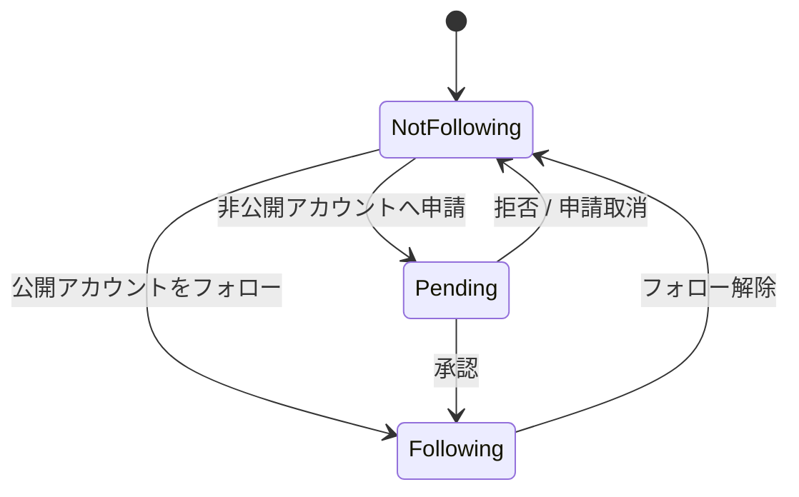
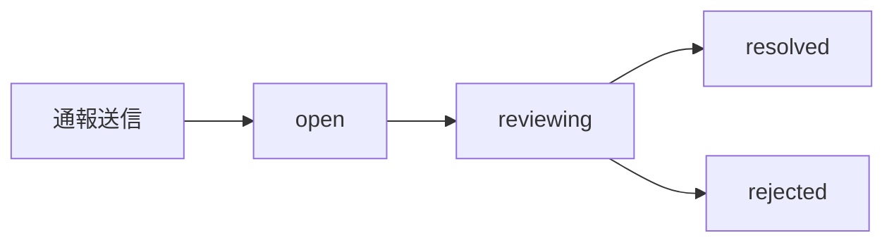
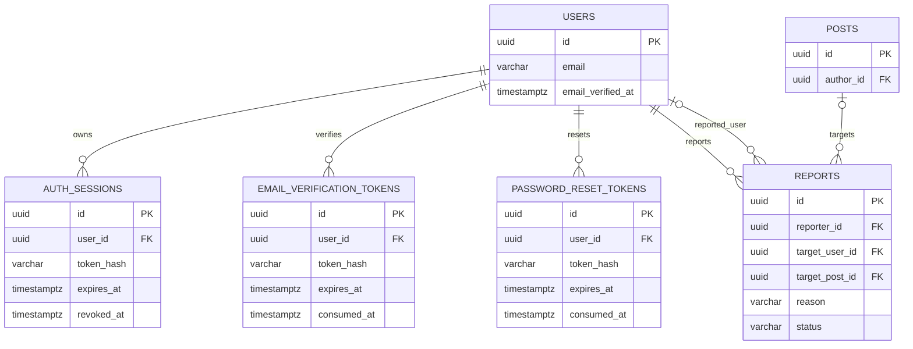
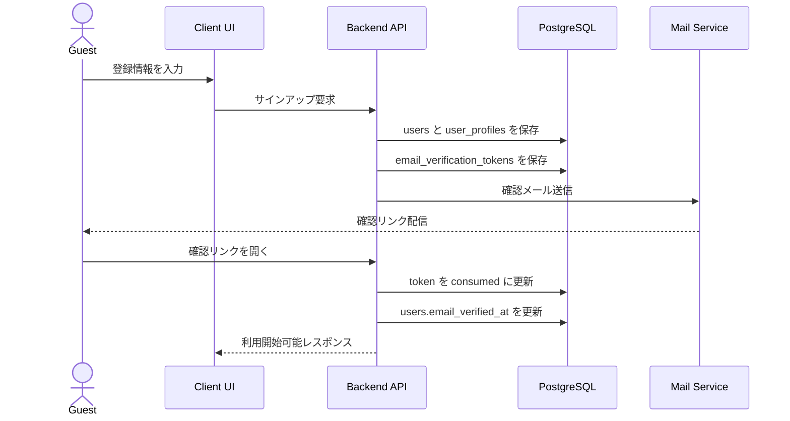
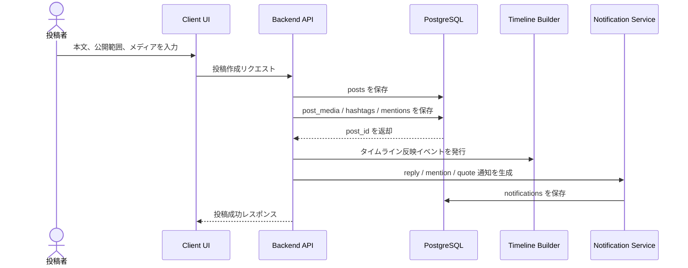
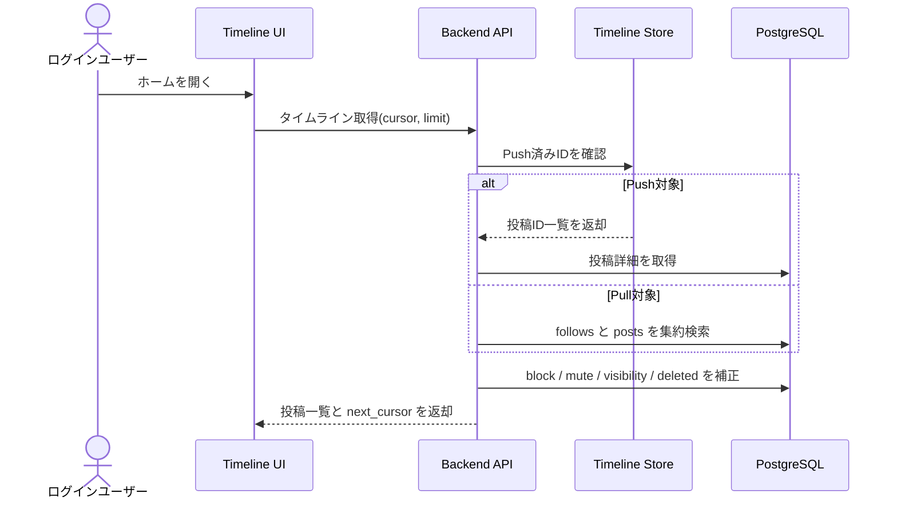
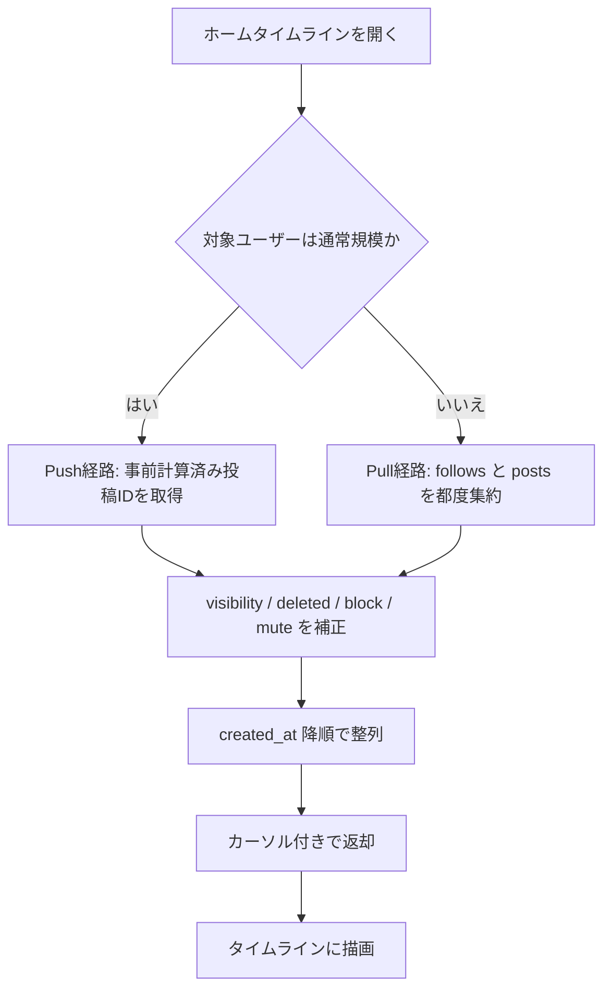

# tiny-sns MVP仕様書（再作成版）

## 1. 文書の目的

この文書は、以下の既存資料から tiny-sns の MVP を再構成した仕様書です。

- `docs/sns.dbml`
- `Considerations/pull_push_timeline.md`

今回の再作成では、前回不足として整理した認証、アカウント公開設定、パスワード再設定、通報、性能面の最小要件まで仕様に含め、DBML にも反映しています。

## 2. プロダクト概要

tiny-sns は、テキスト中心の Twitter ライクな SNS を学習用途で構築するための MVP です。利用者はアカウントを作成し、プロフィールを設定し、投稿を作成し、他ユーザーをフォローし、ホームタイムラインで投稿を消費し、通知と安全機能を用いて関係を管理します。

### 2.1 主な提供価値

- 軽量なテキスト投稿と画像・動画添付
- フォロー関係に基づくリアルタイム感のあるタイムライン体験
- 返信、引用、いいね、リポスト、ブックマークによる交流
- メンション、通知、検索による発見導線
- ミュート、ブロック、通報による最低限の安全対策

### 2.2 機能スコープ

共有図としての機能スコープ図は [Mermaid図一覧](./mermaid_diagrams.md#scope-diagram) を参照してください。

この図で押さえるべき点は次の通りです。

- MVP の中心が `認証・アカウント`、`投稿`、`タイムライン` にあること
- `検索・発見` と `安全管理` も MVP の初期範囲に含めていること
- フォロー申請、通報、パスワード再設定のような周辺機能も初期設計に含めていること

## 3. 想定ユースケース

- ゲストがアカウントを作成し、メール確認を完了して利用を開始する
- ログイン済みユーザーがプロフィールを整え、公開アカウントまたは承認制アカウントとして運用する
- ユーザーがテキスト投稿に画像または動画を添付して公開、返信、引用する
- フォローしたユーザーの投稿をホームタイムラインで閲覧し、いいねやリポストで反応する
- ハッシュタグや検索から新しいユーザーや投稿を見つける
- 不快な相手をミュートまたはブロックし、必要に応じて通報する

## 4. 機能一覧

| 分類 | ID | 機能 | 概要 | 主なデータ |
| --- | --- | --- | --- | --- |
| 認証 | FR-01 | 新規登録 | ハンドル、表示名、メール、パスワードでアカウントを作成する | `users` |
| 認証 | FR-02 | ログイン/ログアウト | 認証済みセッションを開始・終了する | `auth_sessions` |
| 認証 | FR-03 | セッション管理 | 複数端末セッションを保持し、失効させる | `auth_sessions` |
| 認証 | FR-04 | メール確認 | 登録後のメール確認を完了させる | `users.email_verified_at`、`email_verification_tokens` |
| 認証 | FR-05 | パスワード再設定 | 再設定トークンでパスワードを更新する | `password_reset_tokens` |
| アカウント | FR-06 | アカウント状態管理 | `active` を基本とし停止状態を扱う | `users.status` |
| アカウント | FR-07 | 公開アカウント設定 | 承認制フォローが必要な非公開アカウントを設定する | `users.is_private` |
| プロフィール | FR-08 | プロフィール表示 | 自己紹介、所在地、Webサイト、誕生日、画像を表示する | `user_profiles` |
| プロフィール | FR-09 | プロフィール編集 | 表示名、bio、画像などを更新する | `users`、`user_profiles` |
| プロフィール | FR-09a | 固定ツイート設定 | 自分の投稿を1件プロフィール上部に固定表示する | `user_profiles.pinned_post_id` |
| 投稿 | FR-10 | 投稿作成 | テキスト投稿を作成する | `posts` |
| 投稿 | FR-11 | 投稿編集/削除 | 投稿本文の更新と論理削除を行う | `posts.updated_at`、`posts.deleted_at` |
| 投稿 | FR-12 | 公開範囲設定 | `public`、`unlisted`、`followers`、`private` を使い分ける | `posts.visibility` |
| 投稿 | FR-13 | 返信 | 既存投稿に返信してスレッドを形成する | `posts.reply_to_post_id` |
| 投稿 | FR-14 | 引用投稿 | 既存投稿を引用して投稿する | `posts.quote_post_id` |
| 投稿 | FR-15 | メディア添付 | 画像または動画を順序付きで投稿に添付する | `media`、`post_media` |
| タイムライン | FR-16 | ホームタイムライン | 自分とフォロー中ユーザーの投稿を時系列で表示する | `follows`、`posts` |
| タイムライン | FR-17 | ユーザー投稿一覧 | 特定ユーザーの投稿を表示する | `posts.author_id` |
| タイムライン | FR-18 | 投稿詳細/スレッド表示 | 投稿本文、返信、引用、反応数を表示する | `posts` |
| タイムライン | FR-19 | ブックマーク一覧 | 保存済み投稿を再表示する | `bookmarks` |
| 交流 | FR-20 | フォロー/解除 | ユーザー間の購読関係を作成または解除する | `follows` |
| 交流 | FR-21 | フォロー申請承認/拒否 | 非公開アカウント向けの申請を処理する | `follows.status` |
| 交流 | FR-22 | いいね | 投稿への肯定反応を記録する | `likes` |
| 交流 | FR-23 | リポスト | 投稿の再共有を記録する | `reposts` |
| 交流 | FR-24 | ブックマーク | 後で読むための保存を記録する | `bookmarks` |
| 交流 | FR-25 | ハッシュタグ抽出 | 投稿保存時にタグを抽出して紐付ける | `hashtags`、`post_hashtags` |
| 交流 | FR-26 | メンション抽出 | 投稿保存時に言及ユーザーを抽出する | `mentions` |
| 通知 | FR-27 | 通知一覧 | フォロー、いいね、リポスト、返信、メンション、引用を通知する | `notifications` |
| 通知 | FR-28 | 通知既読化 | 通知を既読/未読で管理する | `notifications.read_at` |
| 発見 | FR-29 | 検索 | ユーザー、投稿、ハッシュタグを検索する | `users`、`posts`、`hashtags` |
| 安全 | FR-30 | ミュート | 特定ユーザーをタイムライン上で抑制する | `mutes` |
| 安全 | FR-31 | ブロック | 特定ユーザーとの可視関係を遮断する | `blocks` |
| 安全 | FR-32 | 通報 | ユーザーまたは投稿を運営観点で記録する | `reports` |

## 5. 画面一覧

### 5.1 画面遷移

共有図としての画面遷移図は [Mermaid図一覧](./mermaid_diagrams.md#screen-flow-diagram) を参照してください。

この遷移図で把握すべき点は次の通りです。

- 未ログイン状態の入口が `新規登録`、`ログイン`、`パスワード再設定` であること
- ログイン後は `ホームタイムライン` が主要ハブになること
- `投稿詳細` と `プロフィール` の両方から通報へ進めること
- `設定` 配下にフォロー申請処理とミュート/ブロック管理をまとめていること

### 5.2 画面定義

| ID | 画面名 | 目的 | 主なUI要素 |
| --- | --- | --- | --- |
| SC-01 | ログイン画面 | 既存ユーザーが利用開始する | メールアドレス、パスワード、ログインボタン |
| SC-02 | 新規登録画面 | 新規アカウントを作成する | ハンドル、表示名、メール、パスワード |
| SC-03 | メール確認待ち画面 | メール確認導線を案内する | 送信済みメッセージ、再送ボタン |
| SC-04 | パスワード再設定申請画面 | 再設定メールを送る | メールアドレス入力、送信ボタン |
| SC-05 | パスワード再設定完了画面 | 新しいパスワードを登録する | 新パスワード、確認入力、確定ボタン |
| SC-06 | ホームタイムライン画面 | フォロー中ユーザーと自分の投稿を読む | 投稿一覧、並び順、カーソル読み込み |
| SC-07 | 投稿作成/編集画面 | 新規投稿または投稿編集を行う | 本文入力、公開範囲、メディア添付、投稿ボタン |
| SC-08 | 投稿詳細画面 | 単一投稿、返信、引用、反応を確認する | 投稿本文、返信一覧、反応数、アクション群 |
| SC-09 | プロフィール画面 | ユーザー情報と投稿一覧を表示する | ヘッダー画像、アイコン、自己紹介、固定ツイート、投稿一覧 |
| SC-10 | プロフィール編集画面 | 自分のプロフィールを更新する | 表示名、bio、location、website、画像変更 |
| SC-11 | フォロー/フォロワー一覧画面 | ソーシャルグラフを確認する | 一覧、フォロー状態、遷移導線 |
| SC-12 | 通知一覧画面 | 自分宛の反応を確認する | 通知タイプ、アクター、対象投稿、既読状態 |
| SC-13 | ブックマーク一覧画面 | 保存済み投稿を再閲覧する | 投稿カード、解除導線 |
| SC-14 | 検索画面 | ユーザー、投稿、タグを探す | 検索入力、タブ切替、結果一覧 |
| SC-15 | ハッシュタグ投稿一覧画面 | タグごとの投稿を閲覧する | タグ名、投稿一覧、ページネーション |
| SC-16 | 公開/セキュリティ設定画面 | アカウント公開設定やセッション操作を行う | 非公開切替、ログアウト、セッション一覧 |
| SC-17 | フォロー申請一覧画面 | 承認待ち申請を処理する | 申請一覧、承認、拒否 |
| SC-18 | ミュート/ブロック管理画面 | 非表示対象や遮断対象を管理する | ユーザー一覧、解除操作 |
| SC-19 | 通報画面 | 投稿またはユーザーを通報する | 通報対象、理由選択、詳細入力、送信ボタン |

## 6. 業務ルール

### 6.1 基本ルール

- `handle` と `email` は一意である
- 1ユーザーに対してプロフィールは1件である
- 投稿は必ず `author_id` を持ち、本文は必須である
- 投稿削除は物理削除ではなく論理削除を優先する
- `likes`、`reposts`、`bookmarks` はユーザーと投稿の組み合わせで一意である
- `follows`、`blocks`、`mutes` はユーザー組み合わせで一意である
- 自分自身をフォロー、ミュート、ブロックできない
- 非公開アカウントでは新規フォローは `pending` で開始し、承認後に `accepted` となる
- `user_profiles.pinned_post_id` は任意で、設定される場合は1件だけである
- 固定ツイートはプロフィール所有者本人の未削除投稿だけを指定できる
- 固定ツイートはプロフィール画面の先頭に表示し、ホームタイムラインの並び順には影響しない
- ハッシュタグとメンションは投稿保存時に抽出・正規化して関連テーブルへ保存する
- 通知は `read_at` が `null` の間は未読である
- ミュート対象はホームタイムラインと通知で露出抑制する
- ブロック対象はプロフィール閲覧、フォロー、通知、タイムライン露出を遮断する
- メール確認トークンとパスワード再設定トークンは使い捨てで、有効期限を持つ
- 通報は投稿またはユーザーのどちらか一方を対象として送信する

### 6.2 投稿の公開範囲

| visibility | 閲覧できる人 | ホームタイムライン掲載 | 検索対象 |
| --- | --- | --- | --- |
| `public` | 全員 | 対象になる | 対象にする |
| `unlisted` | 直接リンクを知る人とプロフィール閲覧者 | 対象外 | 原則対象外 |
| `followers` | 承認済みフォロワー | 対象になる | 対象外 |
| `private` | 投稿者本人のみ | 対象外 | 対象外 |

### 6.3 フォロー状態遷移

### 6.4 通報状態遷移

## 7. データモデル概要

### 7.1 SNSコアER図

共有図としてのコアER図は [Mermaid図一覧](./mermaid_diagrams.md#core-er-diagram) を参照してください。

この図でまず見るべき関係は次の通りです。

- `users` と `posts` が SNS の中心にあること
- `follows` がホームタイムラインと公開制御の前提になること
- `likes`、`reposts`、`bookmarks`、`notifications` が交流と反応を支えること
- `post_media`、`post_hashtags`、`mentions` が投稿を補助的に拡張すること

認証系テーブルと通報テーブルは次の拡張ER図で扱います。

### 7.2 認証・運用ER図

### 7.3 エンティティ責務

- `users`: 認証主体と公開アカウント設定の基本単位
- `user_profiles`: 詳細プロフィール情報と固定ツイートの保持先
- `posts`: タイムラインに流れる中心コンテンツ
- `media` と `post_media`: 添付ファイル管理と投稿との順序付き関連
- `follows`: タイムライン構成と公開制御の基礎になる購読関係
- `likes`、`reposts`、`bookmarks`: 主要な反応
- `hashtags`、`mentions`: 検索性と通知生成の補助データ
- `notifications`: ユーザーへのイベント配送履歴
- `auth_sessions`: ログイン済み端末セッション
- `email_verification_tokens`: メール確認用の使い捨てトークン
- `password_reset_tokens`: パスワード再設定用の使い捨てトークン
- `reports`: 通報受付と運営処理の最小単位
- `blocks`、`mutes`: 露出制御と安全機能

## 8. 主要シーケンス

### 8.1 新規登録からメール確認まで

### 8.2 投稿作成から通知生成まで

### 8.3 ホームタイムライン取得

## 9. タイムラインと検索の前提

検討メモからは、ホームタイムラインは単純なオンリードよりも、Push と Pull を使い分けるハイブリッド構成を目指していることが読み取れます。検索は MVP 段階では RDB 上の単純検索を基本とし、専用検索基盤は将来拡張とします。

### 9.1 表示条件

- 自分自身の投稿を含める
- `accepted` のフォロー関係のみを対象とする
- `deleted_at` が設定された投稿は除外する
- 公開範囲、ブロック、ミュートを反映する
- ページネーションはオフセットよりもカーソル方式を優先する

## 10. 今回の DBML 更新内容

| 以前の不足 | 今回の反映 | 目的 |
| --- | --- | --- |
| 承認制フォローの発生条件が未定義 | `users.is_private` を追加 | フォロー申請フローを確定する |
| 固定ツイートの保持先が未定義 | `user_profiles.pinned_post_id` を追加 | プロフィール上部の固定投稿を明示的に扱う |
| ログイン永続化の単位がない | `auth_sessions` を追加 | ログイン/ログアウトとセッション失効を扱う |
| メール確認の保存先がない | `users.email_verified_at` と `email_verification_tokens` を追加 | 本人確認導線を持つ |
| パスワード再設定機構がない | `password_reset_tokens` を追加 | 認証運用の最低限を満たす |
| 通報の保存先がない | `reports` を追加 | モデレーションの入口を持つ |
| タイムライン取得向けインデックスが薄い | `posts`、`follows`、`notifications` などに索引を追加 | MVPでも破綻しにくい読み性能を確保する |
| ハッシュタグ/メンションの逆引きが弱い | `post_hashtags`、`mentions` に索引を追加 | タグ一覧、通知生成、検索を補助する |

DBML の不足項目と今回の判断理由は `docs/dbml_gap_analysis.md` に別紙で整理しています。

## 11. DBML に含めていないもの

- 画像・動画の実ファイル保存先、変換ジョブ、CDN 配信
- 検索専用エンジンや全文検索インデックス
- タイムライン配信用 Redis、キュー、ワーカー実装
- スパム判定、レート制限、監査ログなどの運用高度化要素

これらは重要ですが、RDB のコアスキーマよりもアプリケーション基盤やインフラ設計の責務が強いため、今回は仕様書の前提条件として扱います。

## 12. MVP 実装優先順

1. 新規登録、メール確認、ログイン、セッション管理
2. プロフィール編集、公開設定、パスワード再設定
3. 投稿作成、返信、引用、削除、メディア添付
4. フォロー、ホームタイムライン、プロフィール投稿一覧
5. いいね、リポスト、ブックマーク、通知
6. 検索、ハッシュタグ、メンション
7. ミュート、ブロック、通報、フォロー申請処理

この順番で進めると、SNS として触れる状態を先に作りつつ、後戻りの大きい認証・公開設定・安全機能を早めに固定できます。